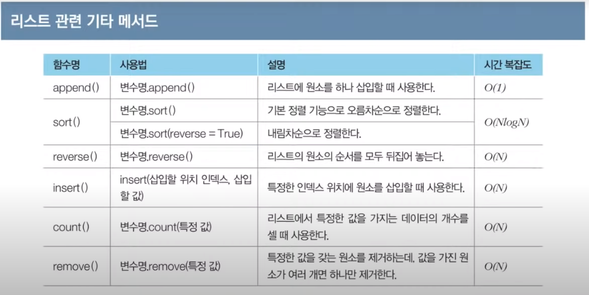

## 연산자

- 나누기 연산자(\/)는 나눠진 결과를 실수형으로 반환한다.
- 나머지 연산자(%) 뿐만 아니라 몫 연산자(\/\/), 거듭제곱 연산자(\*\*)를 지원한다.
- round 함수를 이용하면 자리수에 맞는 반올림 가능

## List

- 대괄호에 넣어 초기화
- 일반적으로,하나의 리스트에는 같은 자료형이 들어간다.
- 음의 정수를 이용하여 인덱싱을 하면 뒤에서부터 읽는다.
  0부터 시작하지 않고, -1부터 시작
- slicing : 시작 인덱스 이상, 마지막 인덱스 미만
- List comprehension : 괄호안에 조건문과 반복문을 적용하여 리스트를 초기화 할 수 있다.

```python
# 0부터 9까지의 수를 포함하는 리스트
array = [i for i in range(10)]
# 0부터 19까지의 수 중에서 홀수만 포함하는 리스트
array = [i for i in range(20) if i % 2 ==1]
# N * M 크기의 2차원 리스트 초기화
array = [[0]*m for _ in range(n)]
```



## String

- 초기화할 때, ", ' 모두 사용 가능
- 연산자를 사용해서 문자열 처리 가능 (slicing도 가능)

## Tuple

- 리스트와 유사하지만 한 번 선언된 값을 변경할 수 없다.
- 튜플은 소괄호를 사용한다.

## Dictionary

- key, value의 쌍을 데이터로 가지는 자료형
- Immutable 자료형을 키로 사용할 수 있다
- 데이터의 검색 및 수정에 O(1)의 속도로 처리 가능
- keys(), values() 지원
- get() method  
dict에서 키 값에 해당하는 값을 호출할 때, 해당 키 값이 없는 경우에 초기화 값을 지정해주는 메서드
```python
# 프로그래머스 여행경로 문제 예
# tickets 리스트를 dict로 바꾸는 과정

tickets = [["ICN", "JFK"], ["HND", "IAD"], ["JFK", "HND"]]
routes = {}

# get을 사용하지 않음
for start, end in tickets:
    if start in routes.keys():
        routes[start].append(end)
    else:
        routes[start]=[end]

# get을 사용한 예
for (start, end) in tickets:
    routes[start] = routes.get(start, []) + [end]

```
## Set

- 중복 불허, 순서가 없음
- set()을 이용하면 리스트, 문자열을 이용해서 초기화 가능 (혹은 중괄호로 초기화)
- add(), update(), remove()

```python
data = set([1,2,3])
data.add(4)
# 새로운 원소 여러 개 추가
data.update([5,6])
data.remove(3)
# data = [1,2,4,5,6]
```

## 기본 입출력

- input() 함수는 __한 줄의 문자열을 입력받는 함수__
- Map() 함수는 __리스트의 모든 원소에 각각 특정한 함수를 적용__
- 빠르게 입력을 받는 경우, `sys`를 import하고 sys.stdin.readlin().rstrip() 이용
- print()는 __기본적으로 출력 이후에 줄 바꿈을 수행__ end() 사용하여 구분자를 지정 가능
- print() 내에서는 같은 자료형으로 맞춰준다.

```python
# 공백으로 구분된 데이터(정수형)를 입력 받을 때
list(map(int, input().split()))

# 2차원 배열을 받는 경우
n = int(input())
m = int(input())

arr = []
for i in range(n):
    arr.append(list(map(int, input().split())))
```

## 조건문

- pass 키워드를 사용하면 if문의 블록을 건너뛸 수 있다

```python
# 다음과 같이 간소화하여 표현할 수 있다
score = 85
result = "합격" if score >= 80 else "불합격"
```

## 함수

- global 키워드를 사용하면 함수 내부에서 바깥의 변수 값에 접근할 수 있다
- 함수가 여러 개의 반환 값을 가질 수 있다
- 람다 표현식으로 함수를 간단하게 작성 가능  
함수의 출력이 다른 함수의 입력으로 사용되는 경우

## 표준 라이브러리

- itertools : 순열과 조합 라이브러리  
permutations : 순열  
combinations : 조합
product : 중복 허용 순열
combinations_with_replacement : 중복 허용 조합

- heapq : 힙 기능을 제공하는 라이브러리. 우선순위 큐 구현 위해 사용
- bisect : 이진 탐색 기능을 제공하는 라이브러리
- collections : 덱, 카운터 등을 포함하는 라이브러리
- eval : 수식 input의 결과를 반환한다


